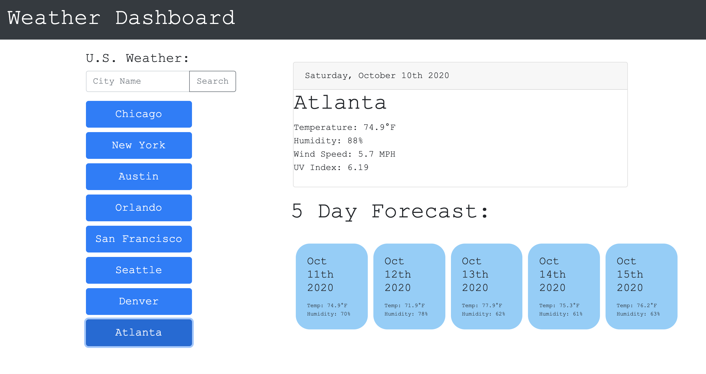

# Katie's Weather Dashboard

## Description
This app was created to populate any weather forecast a user wishes to see. You are able to see the current weather of a city of choice, as well as the five day forecast for that city. Please be sure to read the note at the bottom of the ReadMe.

## Goals
The main goal was to make the weather search process extremely easy for the user to access any U.S. forecast. Specifically the buttons with popular U.S. cities, the user simply has to press a button to get a 5 day forecast. 

## Design Process 
The design of this project is minimal and simple for both ease to the eye and user interface simplicity. The first part of the design process was ensuring the grid was working appropriately. That meant using two columns: one was 1/3 the screen size and the other column was 2/3 the screen size. Bootstrap was used to do this. 

## Technology Used
- Bootstrap
- Jquery
- Moment.Js

## APIs
- Open Weather Map - https://openweathermap.org/api
    - The weather was taken from the above link and converted from Kelvin to Fahrenheit within the code. 

### Issues Along the Way
- My code is definitely not as dry as it could be with some code being repetitive.
- I was unable to code the local storage so that the last search appeared on the screen when the browser was refreshed. However, the last search does save in local storage. 

## NOTE:
I hid my API key by using a config.js file so you as the user will need to make your own javascript 'config.js' file, with your own key in an object:
Copy and paste this into your config.js file: 

var config = {
myKey : *"YOUR KEY GOES HERE"*
}

you can get your own API key by creating an account here: https://home.openweathermap.org/users/sign_in and requesting an API key.